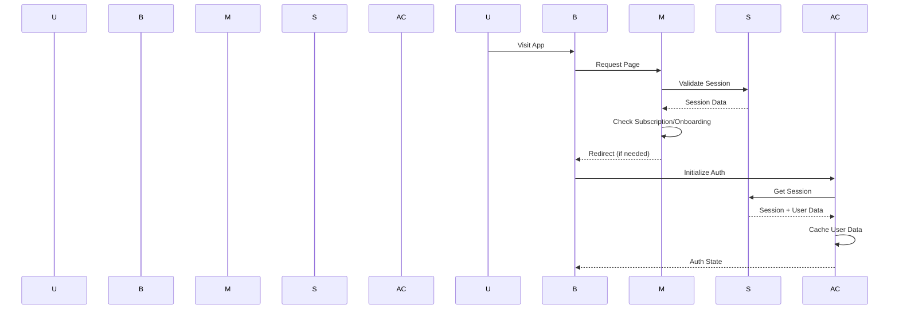
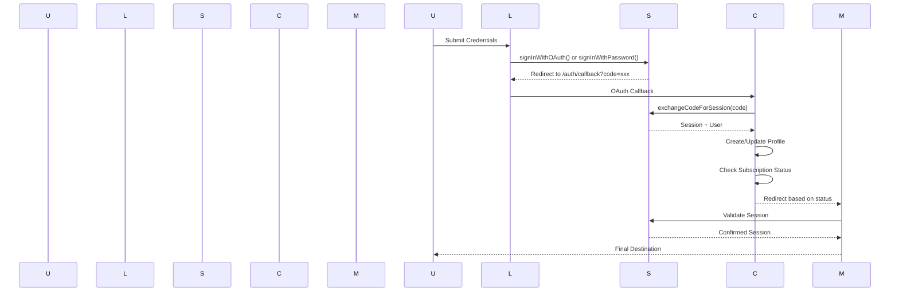
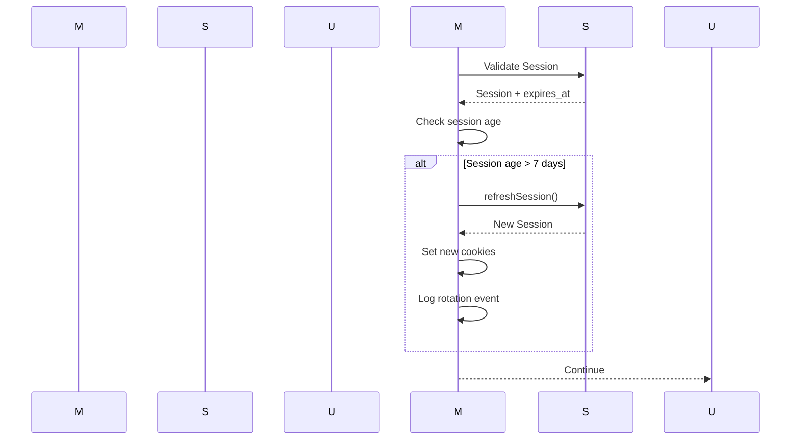
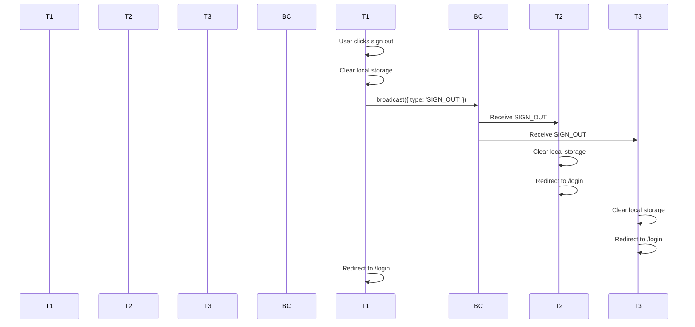

# 🔐 RaptorFlow Authentication Architecture

## Overview

RaptorFlow implements a comprehensive, secure, and scalable authentication system using Supabase as the primary authentication provider. The system is designed with security best practices, developer experience, and production readiness in mind.

---

## 🏗️ **Architecture Overview**

```
┌─────────────────┐    ┌──────────────────┐    ┌─────────────────┐
│   Frontend      │    │   Middleware     │    │   Supabase      │
│   (Client)       │◄──►│   (Edge Runtime)  │◄──►│   (Auth Service) │
└─────────────────┘    └──────────────────┘    └─────────────────┘
         │                       │                       │
         │                       │                       │
         ▼                       ▼                       ▼
┌─────────────────┐    ┌──────────────────┐    ┌─────────────────┐
│ Auth Context    │    │ Session Validation│    │ User Profiles   │
│ Auth Service    │    │ Rate Limiting     │    │ Subscriptions  │
│ Cross-Tab Sync  │    │ Security Headers  │    │ Workspaces     │
└─────────────────┘    └──────────────────┘    └─────────────────┘
```

---

## 🔑 **Core Components**

### 1. **Centralized Authentication Service** (`src/lib/auth-service.ts`)

The heart of the authentication system, providing three distinct services:

#### **ClientAuthService**
```typescript
// Client-side authentication management
class ClientAuthService {
  private supabase = createClient()
  private crossTabManager: CrossTabManager | null = null
  
  // Core operations
  async getSession(): Promise<Session | null>
  async getCurrentUser(): Promise<AuthUser | null>
  async signOut(): Promise<{ success: boolean; error?: string }>
  async refreshUser(): Promise<AuthUser | null>
  
  // Caching
  getCachedUser(): AuthUser | null
  private cacheUser(user: AuthUser): void
}
```

**Responsibilities:**
- Session management on client side
- User data caching (5-minute TTL)
- Cross-tab communication
- Local storage cleanup

#### **ServerAuthService**
```typescript
// Server-side authentication for middleware/API routes
class ServerAuthService {
  private supabase: any
  
  async validateSession(): Promise<{ valid: boolean; user?: any; needsRotation?: boolean }>
  async rotateSession(): Promise<{ success: boolean; session?: Session; error?: string }>
  private async loadUserDataWithWorkspace(supabaseUser: SupabaseUser): Promise<any>
}
```

**Responsibilities:**
- Session validation in middleware
- Workspace lookup to prevent redirect loops
- Session rotation for security
- Robust metadata fallbacks

#### **ServiceRoleAuthService**
```typescript
// Admin-only operations with elevated privileges
class ServiceRoleAuthService {
  private static instance: ServiceRoleAuthService
  private supabase: any
  
  static getInstance(): ServiceRoleAuthService
  getSupabaseClient(): any
  async updateUserRole(userId: string, role: string): Promise<{ success: boolean; error?: string }>
  async getUserById(userId: string): Promise<any>
}
```

**Responsibilities:**
- Admin operations only
- Service role key management
- User management functions
- Database admin tasks

---

### 2. **Cross-Tab Communication** (`CrossTabManager`)

Ensures session consistency across multiple browser tabs:

```typescript
class CrossTabManager {
  private broadcastChannel: BroadcastChannel | null = null
  private storageKey = 'auth_session_event'
  private isEdgeRuntime: boolean
  
  // Communication methods
  public broadcastSignOut(): void
  public broadcastSessionRefresh(session: Session): void
  
  // Event handlers
  private handleBroadcastMessage(event: MessageEvent): void
  private handleStorageEvent(event: StorageEvent): void
  private handleSignOut(): void
  private handleSessionRefresh(session: Session): void
}
```

**Features:**
- **Modern Browsers**: Uses BroadcastChannel API
- **Legacy Support**: Falls back to localStorage events
- **Edge Runtime**: Skipped (not needed in middleware)
- **Automatic Cleanup**: Removes events after processing

---

### 3. **Middleware Security Layer** (`src/middleware.ts`)

The first line of defense for all incoming requests:

```typescript
export async function middleware(request: NextRequest) {
  // 1. Security validations
  if (!validateIP(ip)) return new NextResponse('Forbidden', { status: 403 })
  if (!validateUserAgent(userAgent)) return new NextResponse('Forbidden', { status: 403 })
  if (!validatePath(path)) return new NextResponse('Forbidden', { status: 403 })
  
  // 2. Session validation
  const serverAuth = createServerAuth(request)
  const sessionValidation = await serverAuth.validateSession()
  
  // 3. Rate limiting with bypasses
  if (!checkRateLimit(ip!, isAuth, user?.role === 'admin')) {
    if (!path.startsWith('/api/health') && !path.startsWith('/api/monitoring')) {
      return new NextResponse('Too Many Requests', { status: 429 })
    }
  }
  
  // 4. Route protection logic
  // 5. Security headers
  // 6. Session rotation
}
```

**Security Features:**
- **IP Validation**: Allows 127.x and private ranges in development
- **User Agent Blocking**: Prevents bots and scrapers
- **Rate Limiting**: Different limits for anonymous/authenticated/admin users
- **Health Check Bypass**: Allows monitoring endpoints through
- **Security Headers**: CSP, XSS protection, frame options

---

## 🔄 **Authentication Flow**

### 1. **Initial Load & Session Recovery**



**Steps:**
1. User visits any page
2. Middleware validates session using anon key
3. If authenticated, checks subscription/onboarding status
4. Redirects if needed (login, plans, onboarding, dashboard)
5. AuthContext initializes with session data
6. User data cached for 5 minutes

### 2. **Login Flow**



**Login Destinations:**
- **No subscription** → `/onboarding/plans`
- **Subscription + No onboarding** → `/onboarding`
- **Subscription + Onboarding complete** → `/dashboard`

### 3. **Session Rotation**



**Rotation Triggers:**
- Session age > 7 days
- Missing expires_at (assume rotation needed)
- Invalid expires_at format

---

## 🛡️ **Security Architecture**

### 1. **Key Separation Strategy**

```typescript
// Client-side (browser) - ANON KEY ONLY
const clientSupabase = createClient(
  process.env.NEXT_PUBLIC_SUPABASE_URL!,
  process.env.NEXT_PUBLIC_SUPABASE_ANON_KEY!
)

// Server-side (middleware) - ANON KEY ONLY
const serverSupabase = createServerClient(
  process.env.NEXT_PUBLIC_SUPABASE_URL!,
  process.env.NEXT_PUBLIC_SUPABASE_ANON_KEY!,
  { cookies: { ... } }
)

// Admin operations only - SERVICE ROLE KEY
const adminSupabase = createClient(
  process.env.NEXT_PUBLIC_SUPABASE_URL!,
  process.env.SUPABASE_SERVICE_ROLE_KEY!
)
```

**Key Usage Rules:**
- **Anon Key**: User sessions, client-side operations
- **Service Role**: Admin operations, server-side only
- **Never**: Service role key in client code

### 2. **Content Security Policy**

```typescript
response.headers.set(
  'Content-Security-Policy',
  [
    "default-src 'self'",
    "script-src 'self' 'unsafe-inline' 'unsafe-eval' https://apis.google.com",
    "style-src 'self' 'unsafe-inline'",
    "img-src 'self' data: https: blob:",
    "font-src 'self' data:",
    "connect-src 'self' https://api.supabase.io https://*.supabase.co " +
    "http://127.0.0.1:54321 ws://127.0.0.1:54321 " +
    "http://localhost:54321 ws://localhost:54321 " +
    "http://localhost:8000 " +
    "http://localhost:3000 http://localhost:3001 http://localhost:3002 " +
    "http://localhost:3003 http://localhost:3004 http://localhost:3005 " +
    "ws://localhost:3001 ws://localhost:3002 ws://localhost:3003 " +
    "ws://localhost:3004 ws://localhost:3005",
    "frame-ancestors 'none'"
  ].join('; ')
)
```

### 3. **Rate Limiting Strategy**

```typescript
const SECURITY_CONFIG = {
  RATE_LIMIT: {
    anonymous: 10,      // requests/minute
    authenticated: 100,  // requests/minute
    admin: 1000         // requests/minute
  }
}

// Bypass for health checks
if (path.startsWith('/api/health') || path.startsWith('/api/monitoring')) {
  // Allow through without rate limiting
}
```

---

## 📊 **Database Schema**

### Core Tables

```sql
-- Users (Supabase Auth)
auth.users (id, email, email_confirmed, created_at)

-- Profiles (Extended user data)
CREATE TABLE public.profiles (
    id UUID PRIMARY KEY REFERENCES auth.users(id) ON DELETE CASCADE,
    email TEXT NOT NULL,
    full_name TEXT,
    avatar_url TEXT,
    ucid TEXT UNIQUE DEFAULT public.generate_ucid(),
    role TEXT DEFAULT 'user' CHECK (role IN ('user', 'admin')),
    onboarding_status TEXT DEFAULT 'pending',
    subscription_plan TEXT DEFAULT 'free',
    subscription_status TEXT DEFAULT 'none',
    workspace_preferences JSONB DEFAULT '{}',
    created_at TIMESTAMPTZ DEFAULT NOW(),
    updated_at TIMESTAMPTZ DEFAULT NOW()
);

-- Subscriptions
CREATE TABLE public.subscriptions (
    id UUID PRIMARY KEY DEFAULT gen_random_uuid(),
    user_id UUID NOT NULL REFERENCES public.profiles(id) ON DELETE CASCADE,
    plan_id TEXT NOT NULL,
    status TEXT NOT NULL,
    current_period_start TIMESTAMPTZ NOT NULL,
    current_period_end TIMESTAMPTZ NOT NULL,
    cancel_at_period_end BOOLEAN DEFAULT FALSE
);

-- Workspaces
CREATE TABLE public.workspaces (
    id UUID PRIMARY KEY DEFAULT gen_random_uuid(),
    owner_id UUID NOT NULL REFERENCES public.profiles(id) ON DELETE CASCADE,
    name TEXT NOT NULL,
    settings JSONB DEFAULT '{}',
    created_at TIMESTAMPTZ DEFAULT NOW()
);
```

### Row Level Security (RLS)

```sql
-- Profiles RLS
CREATE POLICY "Users can view own profile" ON public.profiles
    FOR SELECT USING (auth.uid() = id);

CREATE POLICY "Users can update own profile" ON public.profiles
    FOR UPDATE USING (auth.uid() = id);

-- Subscriptions RLS
CREATE POLICY "Users can view own subscriptions" ON public.subscriptions
    FOR SELECT USING (user_id = auth.uid());

-- Workspaces RLS
CREATE POLICY "Users can view own workspaces" ON public.workspaces
    FOR SELECT USING (owner_id = auth.uid());
```

---

## 🔧 **Environment Configuration**

### Development Environment
```bash
# .env.local
NEXT_PUBLIC_SUPABASE_URL=https://your-project.supabase.co
NEXT_PUBLIC_SUPABASE_ANON_KEY=eyJhbGciOiJIUzI1NiIs...
SUPABASE_SERVICE_ROLE_KEY=eyJhbGciOiJIUzI1NiIs...
NEXT_PUBLIC_APP_URL=http://localhost:3002
NODE_ENV=development
```

### Production Environment
```bash
# Vercel Environment Variables
NEXT_PUBLIC_SUPABASE_URL=@supabase-url
NEXT_PUBLIC_SUPABASE_ANON_KEY=@supabase-anon-key
SUPABASE_SERVICE_ROLE_KEY=@supabase-service-role-key
NEXT_PUBLIC_APP_URL=@vercel-url
NODE_ENV=production
```

---

## 🚨 **Error Handling & Security**

### 1. **Authentication Errors**

```typescript
// 401 Unauthorized - Redirect to login
if (!isAuth && protectedRoutes.some(route => path.startsWith(route))) {
  const loginUrl = new URL('/login', request.url)
  loginUrl.searchParams.set('redirect', path)
  return NextResponse.redirect(loginUrl)
}

// 403 Forbidden - Admin access denied
if (adminRoutes.some(route => path.startsWith(route)) && !['admin', 'super_admin'].includes(user.role)) {
  await logSecurityEvent('UNAUTHORIZED_ADMIN_ACCESS', 'high', {
    userId: user.id,
    userRole: user.role,
    path
  }, request)
  return new NextResponse('Forbidden', { status: 403 })
}
```

### 2. **Session Validation Errors**

```typescript
// Robust session validation with fallbacks
async function validateSession() {
  try {
    const { data: { session }, error } = await supabase.auth.getSession()
    
    if (error || !session) {
      return { valid: false, error: error?.message || 'No session' }
    }
    
    // Handle missing expires_at
    let needsRotation = false
    if (!session.expires_at) {
      console.warn('Session missing expires_at')
      needsRotation = true
    }
    
    return { valid: true, user: session.user, needsRotation }
  } catch (error) {
    console.error('Session validation error:', error)
    return { valid: false, error: 'Session validation failed' }
  }
}
```

### 3. **Security Event Logging**

```typescript
async function logSecurityEvent(
  eventType: string,
  severity: 'low' | 'medium' | 'high' | 'critical',
  details: Record<string, any>,
  request: NextRequest
) {
  const ip = request.headers.get('x-forwarded-for')?.split(',')[0] || '127.0.0.1'
  
  console.error(`SECURITY_EVENT: ${eventType}`, {
    severity,
    ip,
    userAgent: request.headers.get('user-agent'),
    path: request.nextUrl.pathname,
    ...details
  })
  
  // In production, send to security monitoring service
}
```

---

## 🔄 **Cross-Tab Session Management**

### BroadcastChannel Implementation

```typescript
// Modern browsers
if (typeof BroadcastChannel !== 'undefined' && !this.isEdgeRuntime) {
  this.broadcastChannel = new BroadcastChannel('auth_session')
  this.broadcastChannel.onmessage = (event) => {
    if (event.data.type === 'SIGN_OUT') {
      this.handleSignOut()
    }
  }
}

// Fallback for older browsers
if (typeof window !== 'undefined') {
  window.addEventListener('storage', (event) => {
    if (event.key === this.storageKey && event.newValue) {
      const data = JSON.parse(event.newValue)
      if (data.type === 'SIGN_OUT') {
        this.handleSignOut()
      }
    }
  })
}
```

### Sign Out Flow



---

## 🎯 **Best Practices Implemented**

### 1. **Security First**
- ✅ Key separation (anon vs service role)
- ✅ Row Level Security on all tables
- ✅ Comprehensive CSP headers
- ✅ Rate limiting with bypasses
- ✅ IP validation for development

### 2. **Developer Experience**
- ✅ Centralized auth service
- ✅ Comprehensive error handling
- ✅ Detailed logging
- ✅ Environment validation
- ✅ Type safety throughout

### 3. **Production Ready**
- ✅ Environment-based configuration
- ✅ Security event logging
- ✅ Session rotation
- ✅ Cross-tab consistency
- ✅ Graceful error handling

### 4. **Performance Optimized**
- ✅ Client-side caching (5-minute TTL)
- ✅ Efficient middleware
- ✅ Minimal database queries
- ✅ Async/await patterns
- ✅ No blocking operations

---

## 🔮 **Future Enhancements**

### Short Term
- [ ] Two-factor authentication (2FA)
- [ ] Social login providers (GitHub, Microsoft)
- [ ] Session analytics dashboard
- [ ] Advanced audit logging

### Long Term
- [ ] Biometric authentication
- [ ] Hardware security keys
- [ ] Advanced threat detection
- [ ] Zero-trust architecture

---

## 📚 **Usage Examples**

### Basic Authentication Check
```typescript
import { useAuth } from '@/contexts/AuthContext'

function ProtectedComponent() {
  const { user, isAuthenticated, isLoading } = useAuth()
  
  if (isLoading) return <LoadingSpinner />
  if (!isAuthenticated) return <LoginRequired />
  
  return <Welcome user={user} />
}
```

### Server-Side Auth Validation
```typescript
import { createServerAuth } from '@/lib/auth-service'

export async function GET(request: NextRequest) {
  const serverAuth = createServerAuth(request)
  const { valid, user } = await serverAuth.validateSession()
  
  if (!valid) {
    return NextResponse.json({ error: 'Unauthorized' }, { status: 401 })
  }
  
  return NextResponse.json({ user })
}
```

### Admin Operations
```typescript
import { serviceAuth } from '@/lib/auth-service'

export async function POST(request: NextRequest) {
  const supabase = serviceAuth.getSupabaseClient()
  
  const { error } = await supabase
    .from('profiles')
    .update({ role: 'admin' })
    .eq('id', userId)
  
  if (error) {
    return NextResponse.json({ error: error.message }, { status: 500 })
  }
  
  return NextResponse.json({ success: true })
}
```

---

## 🏆 **Conclusion**

The RaptorFlow authentication system provides a robust, secure, and developer-friendly foundation for user management. It implements industry best practices while maintaining excellent performance and user experience.

**Key Strengths:**
- 🔐 **Security**: Comprehensive protection at multiple layers
- 🚀 **Performance**: Optimized for speed and efficiency
- 🛠️ **Maintainability**: Centralized and well-documented
- 🔧 **Flexibility**: Extensible for future enhancements
- 📱 **User Experience**: Seamless cross-tab synchronization

The system is production-ready and provides a solid foundation for scaling the application as it grows.
