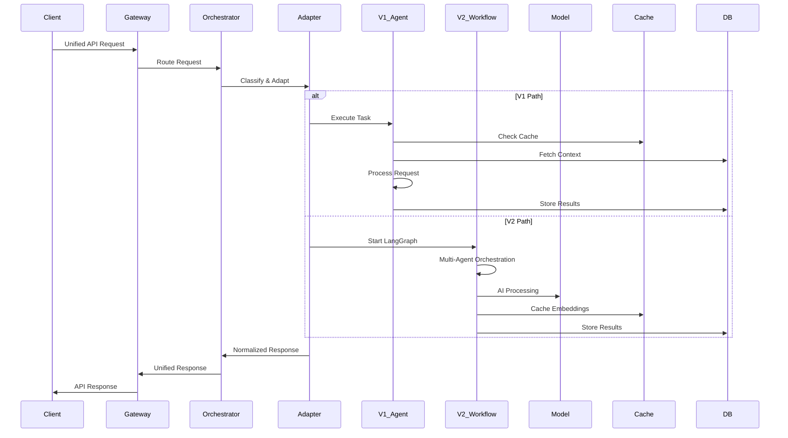
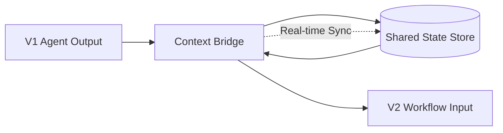
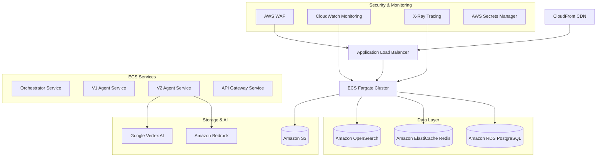

# Unified V1-V2 Backend Architecture Design

## Executive Summary

This document outlines the unified architecture for integrating V1's 17 business intelligence agents with V2's 60+ marketing automation agents into a single, cohesive backend system. The design enables seamless orchestration while maintaining backward compatibility and preparing for AWS deployment.

## Current State Analysis

### V1 System (Business Intelligence)
- **Agents**: 17 specialized agents for market research and strategy
- **Architecture**: Individual REST endpoints with Redis queuing
- **Strengths**: Stable, battle-tested, focused on business insights
- **Issues**: Zod schema complexity, missing connectors, database mismatches

### V2 System (Marketing Automation)
- **Agents**: 60+ agents across 9 departments for end-to-end marketing execution
- **Architecture**: LangChain/LangGraph orchestration with advanced AI workflows
- **Strengths**: Cutting-edge orchestration, multi-agent collaboration, token optimization
- **Status**: ✅ System prompts implemented, ✅ LangChain compatibility fixed

## Unified Architecture Design

### Core Principles

1. **Backward Compatibility**: V1 APIs remain functional during transition
2. **Progressive Enhancement**: V2 capabilities enhance V1 workflows
3. **Unified Orchestration**: Single entry point for all agent interactions
4. **Scalable Design**: AWS-ready with microservices architecture
5. **Cost Optimization**: Intelligent model routing and token budgeting

### Architecture Overview

```mermaid
flowchart TD
    Client[Client Applications]
    API_Gateway[API Gateway / Load Balancer]
    Orchestrator[Unified Orchestrator Service]

    subgraph "Legacy Layer (V1)"
        V1_Routes[V1 Route Handlers]
        V1_Agents[V1 Agents (17)]
        V1_Queue[Redis Job Queue]
    end

    subgraph "Advanced Layer (V2)"
        V2_API[V2 Advanced API]
        LangGraph[LangGraph Orchestrator]
        V2_Agents[V2 Agents (60+)]
        Model_Router[Model Router]
    end

    subgraph "Shared Services"
        Auth[Authentication Service]
        Cache[Redis Cache]
        DB[(PostgreSQL Database)]
        Vector_DB[(Vector Database)]
        Observability[Monitoring & Logging]
    end

    subgraph "External Integrations"
        VertexAI[Google Vertex AI]
        OpenAI[OpenAI API]
        Supabase[Supabase]
        S3[S3 Storage]
    end

    Client --> API_Gateway
    API_Gateway --> Orchestrator

    Orchestrator --> V1_Routes
    Orchestrator --> V2_API

    V1_Routes --> V1_Agents
    V1_Agents --> V1_Queue

    V2_API --> LangGraph
    LangGraph --> V2_Agents
    V2_Agents --> Model_Router

    V1_Agents --> Cache
    V2_Agents --> Cache
    V1_Agents --> DB
    V2_Agents --> DB
    V2_Agents --> Vector_DB

    Model_Router --> VertexAI
    Model_Router --> OpenAI

    Auth --> Supabase
    Cache --> Redis
    DB --> Supabase
```

## Component Specifications

### 1. Unified Orchestrator Service

**Purpose**: Single entry point for all agent interactions, routing requests to appropriate systems.

**Key Features**:
- Request classification and routing
- Unified authentication and authorization
- Response normalization
- Cross-system orchestration capabilities

**API Contract**:
```typescript
interface UnifiedRequest {
  userId: string;
  goal: string;
  context: {
    campaign?: any;
    icp?: any;
    brand?: any;
    constraints?: string[];
  };
  agentSelection?: 'auto' | 'manual';
  selectedAgents?: string[];
  priority?: 'speed' | 'quality' | 'balanced';
}

interface UnifiedResponse {
  executionId: string;
  status: 'queued' | 'processing' | 'completed' | 'failed';
  estimatedCompletion: string;
  agentsInvolved: string[];
  result?: any;
  tokenUsage?: number;
  costEstimate?: number;
}
```

### 2. Adapter Layer

**Purpose**: Enables V1 and V2 systems to communicate and share context.

**Key Components**:
- **V1 Adapter**: Wraps V1 agents with unified interface
- **V2 Adapter**: Translates unified requests to LangGraph workflows
- **Context Bridge**: Shares state between V1 and V2 systems
- **Result Synthesizer**: Combines outputs from multiple systems

**Interface**:
```typescript
interface AgentAdapter {
  execute(request: UnifiedRequest): Promise<UnifiedResponse>;
  getCapabilities(): AgentCapabilities;
  getHealth(): HealthStatus;
}

interface ContextBridge {
  shareContext(fromSystem: 'v1' | 'v2', context: any): Promise<void>;
  getSharedContext(system: 'v1' | 'v2'): Promise<any>;
  synchronizeState(): Promise<void>;
}
```

### 3. Enhanced Model Router

**Purpose**: Intelligent model selection and routing with cost optimization.

**Features**:
- Model performance tracking
- Cost-based routing decisions
- Fallback mechanisms
- Token budget management
- Quality vs. speed optimization

**Routing Logic**:
```typescript
interface ModelRoutingDecision {
  model: string;
  provider: 'vertex' | 'openai' | 'anthropic';
  reason: string;
  costEstimate: number;
  qualityScore: number;
  latencyEstimate: number;
}
```

## Data Flow Architecture

### Request Processing Flow



### State Synchronization Flow



## AWS Deployment Architecture

### Infrastructure Components



### Service Configuration

| Service | Instance Type | Min/Max | Purpose |
|---------|---------------|---------|---------|
| Orchestrator | ECS Fargate | 2/20 | Request routing & orchestration |
| V1 Agents | ECS Fargate | 1/10 | Legacy agent execution |
| V2 Agents | ECS Fargate | 3/50 | LangChain workflows |
| API Gateway | ECS Fargate | 2/15 | External API handling |
| RDS | db.t3.medium | 1 | Primary database |
| ElastiCache | cache.t3.micro | 1/3 | Caching & sessions |
| OpenSearch | t3.small.search | 1/2 | Vector search |

## Migration Strategy

### Phase 1: Infrastructure Setup (Week 1)
1. Deploy AWS infrastructure with Terraform
2. Set up CI/CD pipelines
3. Configure monitoring and logging
4. Deploy unified orchestrator service

### Phase 2: V1 Integration (Week 2)
1. Deploy V1 agents with adapter layer
2. Implement unified API contracts
3. Set up backward compatibility routes
4. Enable V1 through orchestrator

### Phase 3: V2 Integration (Week 3)
1. Deploy V2 agents with LangGraph
2. Implement context bridge
3. Enable V2 workflows through orchestrator
4. Test cross-system orchestration

### Phase 4: Production Migration (Week 4)
1. Blue-green deployment strategy
2. Traffic shifting (10% → 50% → 100%)
3. Performance monitoring
4. Rollback procedures

## API Contract Specifications

### Unified Agent Execution API

```typescript
POST /api/v3/execute
{
  "userId": "string",
  "goal": "string",
  "context": {
    "campaign": {},
    "icp": {},
    "brand": {},
    "constraints": ["string"]
  },
  "agentSelection": "auto|manual",
  "selectedAgents": ["string"],
  "priority": "speed|quality|balanced"
}

Response:
{
  "executionId": "string",
  "status": "queued|processing|completed|failed",
  "estimatedCompletion": "ISO8601",
  "agentsInvolved": ["string"],
  "_links": {
    "status": "/api/v3/status/{executionId}",
    "result": "/api/v3/result/{executionId}"
  }
}
```

### Legacy Compatibility API

```typescript
// V1 routes remain accessible
GET /api/icps → V1 ICP agents
POST /api/campaigns → V1 Campaign agents
// ... existing V1 routes

// New unified routes
POST /api/v3/orchestrate → Advanced multi-agent workflows
GET /api/v3/agents → List all available agents (V1 + V2)
POST /api/v3/learn → Agent learning feedback
```

## Monitoring & Observability

### Key Metrics

1. **Performance Metrics**
   - API response time (target: <2s P95)
   - Agent execution time by type
   - Token usage and costs
   - Cache hit rates

2. **System Health**
   - Service availability (target: 99.9%)
   - Error rates by agent type
   - Queue depths and processing times
   - Resource utilization

3. **Business Metrics**
   - Agent utilization rates
   - User satisfaction scores
   - Feature adoption rates
   - Cost per execution

### Alerting Strategy

- **Critical**: Service downtime, data loss, security breaches
- **Warning**: High error rates, performance degradation, cost overruns
- **Info**: Usage spikes, new agent deployments, system updates

## Security Considerations

### Authentication & Authorization
- JWT-based authentication with refresh tokens
- Role-based access control (RBAC)
- API key support for service integrations
- Multi-factor authentication for admin access

### Data Protection
- End-to-end encryption for sensitive data
- GDPR compliance for EU users
- Data anonymization for analytics
- Secure key management with AWS KMS

### Network Security
- VPC isolation with security groups
- WAF protection against common attacks
- TLS 1.3 encryption for all connections
- Zero-trust network architecture

## Cost Optimization Strategy

### Model Usage Optimization
- Intelligent model routing based on task complexity
- Token budgeting with automatic fallback
- Caching of frequent queries and embeddings
- Batch processing for similar requests

### Infrastructure Costs
- Auto-scaling based on demand patterns
- Spot instances for non-critical workloads
- Cost allocation tags for detailed tracking
- Reserved instances for predictable workloads

### Monitoring & Alerts
- Cost anomaly detection
- Budget alerts at 50%, 80%, 100%
- Monthly cost reporting and forecasting
- Optimization recommendations

## Risk Mitigation

### Technical Risks
- **LangChain Compatibility**: Regular updates and testing
- **Performance Degradation**: Load testing and optimization
- **Data Consistency**: Transaction management and validation
- **Scalability Issues**: Horizontal scaling design

### Operational Risks
- **Downtime During Migration**: Blue-green deployment strategy
- **Data Loss**: Comprehensive backups and testing
- **Security Breaches**: Multi-layer security approach
- **Cost Overruns**: Budget controls and monitoring

### Business Risks
- **Feature Regression**: Comprehensive testing suite
- **User Experience Impact**: Gradual rollout with monitoring
- **Vendor Lock-in**: Multi-cloud design principles
- **Compliance Issues**: Regular audits and updates

## Implementation Roadmap

### Week 1-2: Core Infrastructure
- [ ] AWS infrastructure deployment
- [ ] Unified orchestrator implementation
- [ ] Basic adapter layer
- [ ] CI/CD pipeline setup

### Week 3-4: V1 Integration
- [ ] V1 agent wrapping with adapters
- [ ] Legacy API compatibility
- [ ] Database schema fixes
- [ ] Zod schema corrections

### Week 5-6: V2 Integration
- [ ] V2 agent deployment
- [ ] Context bridge implementation
- [ ] Multi-agent orchestration
- [ ] Performance optimization

### Week 7-8: Production Migration
- [ ] Staging environment testing
- [ ] Blue-green deployment
- [ ] Traffic migration
- [ ] Monitoring and optimization

## Success Criteria

### Technical Success
- ✅ Zero TypeScript compilation errors
- ✅ All V1 and V2 agents functional
- ✅ API response time < 2 seconds P95
- ✅ System availability > 99.9%
- ✅ Cost per request < $0.10

### Business Success
- ✅ All existing V1 functionality preserved
- ✅ V2 marketing automation operational
- ✅ Unified API simplifies client integration
- ✅ Improved user experience and performance
- ✅ Cost-effective scaling

This architecture provides a robust, scalable foundation for the unified V1-V2 backend system, enabling seamless integration while preparing for future growth and AWS deployment.


