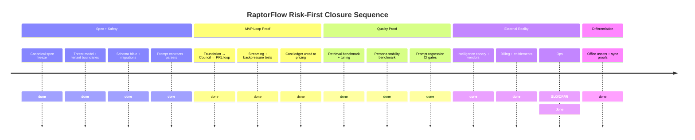

# RaptorFlow Pre-Build Readiness Audit

## Executive verdict

**Do the documents suffice to build an MVP?**  
Yes—**if you build the MVP exactly as defined in the end-to-end plan**: Foundation, “basic” PRL/EEL/Harness, Tactical + Operational Council, Campaign creation + basic task management, Muse basic, Daily Wins—**and explicitly defer** Office, Dynamic Replanning, War Room sessions, full intelligence pipeline, and full 5-pass CORTEX/SWR consolidation. fileciteturn0file10 fileciteturn0file18 fileciteturn0file2

**Do the documents suffice to build a serious v1?**  
Mostly yes, but only after you close a set of materially missing “production reality” artifacts: canonical spec versioning, complete data model + migrations, security model, multi-tenant isolation proofs (DB + vector + cache + tools), prompt regression harness, cost instrumentation tied to *current* model pricing, and the intelligence provider strategy. These are not “nice-to-haves”; they are the difference between a demo and a product. fileciteturn0file7 fileciteturn0file5 fileciteturn0file4

**Do the documents suffice to build the full production vision?**  
Not yet. The big blockers are: (a) asset reality (Office art + animation atlases; avatar essence packs in machine-ingestible form), (b) external intelligence durability (scraping/monitoring/search), (c) long-run eval + regression and persona stability under drift, (d) cross-client “network effect” risks (privacy, compliance, reputational), (e) operations maturity (SLOs, incident response, DR), and (f) spec divergence across “blueprint variants” (Gemini 2.5 vs 3.1, cost constants, caching assumptions). fileciteturn0file19 fileciteturn0file17 fileciteturn0file10 fileciteturn0file12 fileciteturn0file13

**Do the documents suffice to build it “without major problems”?**  
No. “Without major problems” is an unrealistic bar for this particular system because several core pillars are intrinsically adversarial in production: long-lived WebSockets, external web intelligence, multi-agent orchestration at scale, and a memory system that must not leak across tenants. The docs reduce ambiguity a lot (especially Addenda A–C), but they do not remove the need for proofs, assets, vendor contracts, and hostile testing. fileciteturn0file3 fileciteturn0file1 fileciteturn0file4 citeturn5search8turn5search6

**What changed readiness materially?**  
The Red Team Audit explicitly cataloged major “cannot-build” holes in Volumes 1–12 (e.g., ripple creation triggers, prompt reality, Office tech spec, intern implementation, cost tracking). Addendum A (Ripple Creation), Addendum B (Prompt Library), and Addendum C (Office + Intern + closed loops) close several of those holes and make MVP/v1 feasible. fileciteturn0file4 fileciteturn0file3 fileciteturn0file2 fileciteturn0file1

## System map and subsystem readiness

RaptorFlow is specified as a compound system whose “magic” depends on the loop: **Foundation → Council/Harness execution → Memory events → PRL consolidation → EEL personality preservation → future context assembly → better actions**. fileciteturn0file10 fileciteturn0file5 fileciteturn0file6 fileciteturn0file7

```mermaid
flowchart LR
  U[User] --> F[Foundation 21 screens]
  F --> H[Harness: sessions + context assembly + routing]
  H --> C[Council + Strategist synthesis]
  H --> M[MemoryEvent channel]
  M --> PRL[PRL: ripples + retrieval + consolidation]
  PRL --> EEL[EEL: Essence Core + ego state + anti-drift]
  EEL --> H
  H --> CAM[Campaigns + Moves + replanning]
  H --> DW[Daily Wins + Nudges]
  H --> OFF[Office events (evidence)]
  CAM --> M
  DW --> M
  OFF --> U
```

This dependency structure is explicit in the end-to-end doc, and the Office UI is called out as “dependent on all system events to animate,” meaning it cannot be treated as a standalone frontend toy. fileciteturn0file10 fileciteturn0file19 fileciteturn0file1

### Readiness scores by subsystem

Scores are **engineering readiness**, not “how cool the idea is.”

| Subsystem | Score (0–10) | What’s strong | First-to-fail risk | Preconditions to greenlight |
|---|---:|---|---|---|
| Vision/philosophy | 8 | Clear product thesis: “living marketing office,” memory-first compounding value. fileciteturn0file14 fileciteturn0file16 | None (it’s not code) | Freeze product principles into a short “non-negotiables” doc to prevent implementation drift. fileciteturn0file14 |
| Foundation/onboarding | 7 | 21-screen flow + dual scan concept + integration intent into every task context. fileciteturn0file18 fileciteturn0file13 | Data quality + contradictions poisoning downstream outputs | Define “Foundation QA + contradiction resolution” workflow and tests; lock the Foundation JSON schema + migrations. fileciteturn0file18 fileciteturn0file1 |
| PRL memory | 7 | Conceptual spec (Vol 5) plus concrete ingest pipeline and classifier (Addendum A). fileciteturn0file5 fileciteturn0file3 | Retrieval quality + cross-tenant leakage + consolidation bugs | Build retrieval benchmark + red-team leakage tests before shipping “learning.” fileciteturn0file5 citeturn5search8 |
| EEL identity | 6 | Structural approach to persona drift (Essence Core as protected ripples) is coherent. fileciteturn0file6 | Persona drift under long sessions, plus missing machine-ingestible essence packs | Create persona stability eval harness; produce complete `agent_essences` JSONB pack. fileciteturn0file6 citeturn5search6 |
| Harness/orchestration | 7 | Clear component model (Session Manager, Context Assembler, Tool Gateway, Stream Coordinator, Event Harvester). fileciteturn0file7 | Streaming backpressure + WebSocket scaling + failure recovery | Load test with long-lived streams; implement idempotency and replay-safe session events. fileciteturn0file7 citeturn3search4 |
| Council/debate engine | 7 | Session tiering + synthesis concept + memory feedback loop are specified. fileciteturn0file9 | Cost blowups + convergence to bland synthesis | Prompt regressions + cost ceilings + disagreement quality scoring. fileciteturn0file2 fileciteturn0file1 |
| Campaigns/Moves/replanning | 6 | Deep state-machine thinking + dynamic replanning intent. fileciteturn0file8 | Multi-campaign prioritization and real-world execution entropy | Define prioritization policy and operational guardrails; prove replanning doesn’t thrash. fileciteturn0file4 fileciteturn0file8 |
| Daily Wins/Nudges | 6 | Included in MVP; prompt library enumerates generation tasks. fileciteturn0file10 fileciteturn0file2 | Becoming generic “motivational fluff” or spamming users | Set measurable utility criteria, rate limits, and user controls. fileciteturn0file15 |
| Office rendering/event sync | 5 | PixiJS-based technical architecture + `office.event` schema is specified. fileciteturn0file1 | Asset absence + sync drift + “fake office” risk | Obtain full spritesheet pack; prove event ordering, replay, reconnect handling. fileciteturn0file19 |
| Intern system/closed loops | 6 | InternTask dispatch spec exists; cache invalidation + perf feedback loop + cost ledger added. fileciteturn0file1 | Tool abuse, unclear intern output contract in real prompt behavior | Implement tool sandbox + allowlist, and intern result validation. fileciteturn0file7 citeturn5search8 |
| Prompt library/parsing contracts | 8 | TaskType-based Foundation injection + structured `<ripple_data>` pattern. fileciteturn0file2 fileciteturn0file3 | Regression when models change | Automated contract tests with strict JSON schema validation. fileciteturn0file2 |
| Intelligence/search/scraping/monitoring | 4 | Vision exists; exact durable provider plan is not fully locked. fileciteturn0file10 fileciteturn0file13 | Breaks constantly; costs surprise you; legal exposure | Vendor shortlist + fallback stack + compliance review + continuous monitoring. citeturn5search8turn2search0 |
| Infra/auth/billing/multitenancy/ops | 4 | Some stack choices are named (Rust, Aurora, Qdrant, Dragonfly, Clerk). fileciteturn0file12 fileciteturn0file15 | Real production hardening missing | IaC + DR plan + SLOs + billing webhooks + tenant isolation proofs. citeturn3search9turn0search5 |

## Complete gap inventory

This is the list of “what else you still need” to realistically claim “buildable without major problems.” It includes **spec gaps, proof gaps, asset gaps, data gaps, ops gaps, vendor gaps, quality/security/cost/perf/UX gaps**.

### Gap inventory table

Legend:  
**A** = solvable by research/spec now  
**B** = partially solvable (needs prototypes/benchmarks)  
**C** = not solvable by research alone (needs real assets/live infra/vendor/legal/humans)

| Missing item | Why you need it | Partially covered in | Why insufficient | Consequence if ignored | Category | A/B/C |
|---|---|---|---|---|---|---|
| Canonical “single source of truth” spec + versioning | Your docs disagree (model families, cost constants, caching assumptions) | “Production blueprint” vs “Definitive blueprint” vs Harness text fileciteturn0file12 fileciteturn0file13 fileciteturn0file7 | No authoritative reconciliation process | Team builds incompatible modules; cost model lies; regressions | Spec | A |
| Complete DB schema + migrations for **all** tables | You can’t ship on partial CREATE TABLE snippets | Vol 8 (campaigns), Vol 5 (ripples), Addendum C (org_monthly_costs) fileciteturn0file8 fileciteturn0file5 fileciteturn0file1 | Not a complete ER model; missing constraints, indexes, tenant scoping | Data corruption, slow queries, cross-tenant bugs | Spec/Performance/Security | A |
| Machine-ingestible **agent_essences** JSONB pack for 21 avatars | EEL requires concrete Essence Core JSON, not prose | Vol 6 defines structure; Vol 4 has narrative specs fileciteturn0file6 fileciteturn0file17 | Prose ≠ structured JSON; no calibration artifact | Avatars drift, converge, feel fake | Asset/Quality | C |
| Office art + animation asset pack (spritesheets + atlases) | Pixi architecture is useless without assets | Vol 3 + Addendum C fileciteturn0file19 fileciteturn0file1 | No delivered asset library, frame counts, export pipeline proof | Office becomes cheap gimmick; trust collapses | Asset/UX | C |
| Office event ordering/idempotency and reconnect strategy | WebSockets + animation queues must stay consistent | Addendum C defines schema fileciteturn0file1 | Schema ≠ correctness under packet loss/reconnect/out-of-order events | “Office says X happened” when it didn’t | Proof/Quality | B |
| Prompt contract regression harness | Prompts will break as models/providers change | Addendum B lists prompts and formats fileciteturn0file2 | No automated CI harness to detect drift | Silent failure, wrong JSON, broken memory | Quality | A |
| Strict JSON schema validation + safe parsing utilities | `<ripple_data>` and compliance outputs must parse deterministically | Addendum A/B fileciteturn0file3 fileciteturn0file2 | “Format required” isn’t implementation; need tolerant-but-safe parser | PRL ingest fails or stores garbage | Quality/Security | A |
| PRL retrieval benchmark suite | “5-pass CORTEX” isn’t valuable unless retrieval is good | Vol 5 describes retrieval concept fileciteturn0file5 | No metrics, datasets, acceptance thresholds | Memory becomes expensive noise | Proof/Quality | B |
| PRL cross-tenant isolation proofs (DB + vector + cache) | Memory leaks are existential | Harness talks tenant isolation; PRL is shared infra fileciteturn0file7 fileciteturn0file5 | No formal proof strategy nor adversarial tests | Data breach class event | Security | B |
| “Network effect across clients” privacy design | Vol 11 suggests generalized lessons across clients | Vol 11 fileciteturn0file10 | No privacy model, opt-in, anonymization, or legal stance | Trust destruction, regulatory risk | Security/Legal | A→C (policy A, proof C) |
| Persona stability eval + anti-drift metric | EEL claims to solve persona drift; you must verify | Vol 6 (concept) fileciteturn0file6 | No measurement harness | Persona dissolves after weeks | Proof/Quality | B |
| Tool security model (prompt injection, tool abuse) | Your system uses tools + web data → prompt injection surface | Tool Gateway exists fileciteturn0file7 | Needs threat model, sanitization, least privilege, audit logs | Tool misuse, data leaks | Security | A/B |
| External intelligence provider plan (search + crawling + proxies) | Web intelligence breaks constantly; it’s not optional | Vol 11 + definitive blueprint mention monitoring fileciteturn0file10 fileciteturn0file13 | No vendor choices, SLAs, fallbacks, cost ceilings | Intel feature collapses; costs spike | Vendor/Cost | B/C |
| Updated cost model using current token + caching pricing | Your docs hardcode token costs; pricing changes | Addendum C cost tracking + older blueprint fileciteturn0file1 fileciteturn0file12 | Cost constants may be stale; caching/grounding priced separately | Margin fantasy | Cost | A/B |
| Grounding/search quota and billing design | Gemini grounding quotas exist; overages are billed | Model pricing docs | Must build fallback and track usage | Surprise bill or degraded quality | Cost/Vendor | A/B |
| WebSocket infra design for streams | Council streaming + Office event stream is core | Harness + Office addendum fileciteturn0file7 fileciteturn0file1 | Doesn’t include infra-level idle timeouts/keepalive config | Random disconnects, broken UX | Ops/Performance | A/B |
| Multi-campaign prioritization policy | Audit flags it as missing | Red Team Audit fileciteturn0file4 | Not resolved elsewhere | Campaign thrash; user confusion | Spec/UX | A |
| Replanning thrash guardrails | Dynamic replanning can oscillate | Vol 8 (replanning) fileciteturn0file8 | Needs rate limits, hysteresis, human approval criteria | Campaign instability | Quality/UX | A/B |
| Billing + subscription lifecycle (trial, upgrade, delinquency) | You need enforced entitlements and cashflow | User journey mentions auth via Clerk, not full billing fileciteturn0file15 | No end-to-end paid flow spec | Users bypass paywalls; revenue leakage | Ops | A/B |
| Payments webhook design + idempotency | Subscriptions are async | External best practice sources | Not in your RaptorFlow docs | Double-charge, wrong entitlements | Ops/Security | A |
| Legal: ToS + privacy + scraping stance | You collect/store business data and scrape public web | Some “competitor monitoring” assumed fileciteturn0file10 | No legal posture defined | Legal/regulatory exposure | Legal | C |
| Incident response + SLOs + DR | Can’t run a production system without ops maturity | Not fully specified | Missing runbooks; missing RTO/RPO | Outage, data loss, chaos | Ops | A/B |
| Observability stack (traces, metrics, cost attribution) | You need to debug multi-agent + memory | Addendum C adds org_monthly_costs fileciteturn0file1 | That’s only a slice; need tracing across streams and tools | Blind failures | Ops | A |
| Asset pipeline for Office | Even if you have art, you need export tooling | Addendum C hints spritesheets fileciteturn0file1 | No production pipeline, naming conventions enforced | Broken builds, inconsistent animation | Asset/Ops | C |
| Data retention + deletion + export | Users will demand deletion/export | Not specified | Missing GDPR-like behaviors (even if not required, users expect it) | Trust and compliance issues | Legal/Ops | A/C |
| Security review of cross-tenant vector store | Qdrant payload filtering isn’t a tenant boundary by itself | Qdrant supports filters and payload indexing citeturn1search4 | Must enforce tenant scoping at data model + API level | Leakage | Security | B |
| Load testing plan (Council concurrency + Office) | Your UX relies on real-time streams | Not specified | No p95/p99 targets verified | Production instability | Proof/Performance | B |
| Acceptance criteria per feature | “Feels like an office” is subjective unless you measure | Vision docs | No measurable thresholds | Endless bikeshedding | Quality/UX | A |

This table is not “everything that could be nice.” It’s the set of things that, if missing, will produce *predictable* failure modes that your own Red Team Audit already warned about. fileciteturn0file4 fileciteturn0file0

## Gap classification and what to do about it

### Gaps solvable by research/specification now

These are deliverables a Deep Research pass can fully generate into a “pre-build packet.” They do not require running code, just ruthless specification.

#### Spec document set to produce

Below are the **exact documents** I would create to close Category A gaps. Each has acceptance criteria so you can say “closed” instead of “we talked about it.”

**Canonical Spec and Versioning**
- **Title:** RaptorFlow Canonical Spec v0.1 (Source of Truth + Change Control)  
- **Contents:** authoritative decisions (models, pricing constants, caching policy, retrieval passes, deployment targets), doc precedence rules, change log, compatibility guarantees.  
- **Inputs:** all uploaded docs; identify conflicts between the Gemini 2.5 blueprint and Gemini 3.1 Harness references. fileciteturn0file12 fileciteturn0file13 fileciteturn0file7  
- **Acceptance criteria:** every conflicting parameter has one chosen value + rationale; every subsystem lists its “contract inputs/outputs.”

**Complete Data Model and Migrations**
- **Title:** RaptorFlow Schema Bible (Aurora + Vector + Cache)  
- **Contents:** ER diagram, table definitions, indexing strategy, tenant keys, soft-delete strategy, migration strategy, data retention plan.  
- **Inputs:** campaigns table (Vol 8), PRL/ripple schema (Vol 5), agent_essences schema (Vol 6), org_monthly_costs and alerts (Addendum C). fileciteturn0file8 fileciteturn0file5 fileciteturn0file6 fileciteturn0file1  
- **Acceptance criteria:** “new dev can create DB from scratch and run locally,” and every query path has an index plan.

**Security Threat Model**
- **Title:** RaptorFlow Threat Model (LLM + RAG + Tools + Multi-tenant)  
- **Contents:** trust boundaries, attack trees (prompt injection, data exfil, cross-tenant retrieval), mitigations, logging and alerting, red-team test cases, least privilege matrix for tools and tiers.  
- **Inputs:** Tool Gateway tiering (Harness), memory scopes (Addendum A), web intelligence assumptions (Vol 11/blueprints). fileciteturn0file7 fileciteturn0file3 fileciteturn0file10  
- **External validation:** prompt injection and data leakage are core risks in LLM-enabled apps; treat LLM output as untrusted and minimize privilege. citeturn5search8  
- **Acceptance criteria:** every tool has: allowlist, sandbox rules, audit trail, and explicit denial behavior for unsafe outputs.

**Prompt Contracts + Regression Harness**
- **Title:** Prompt Contract Test Suite (TaskType → JSON Schema → Parser)  
- **Contents:** for each TaskType: inputs, injected Foundation sections, required output schemas, parser rules, negative tests, fuzzing, CI gating.  
- **Inputs:** Addendum B prompts + Addendum A extracted_ripple_data expectation. fileciteturn0file2 fileciteturn0file3  
- **Acceptance criteria:** CI fails if JSON is invalid, missing, or deviates in required keys; drift dashboard.

**WebSocket and Streaming Infra Spec**
- **Title:** Streaming Architecture Spec (Council + Office)  
- **Contents:** connection topology, event ordering, replay, idempotency, backpressure, reconnect strategy, load balancer configuration, heartbeats.  
- **External validation:** ALB has configurable idle timeout and client keepalive attributes; defaults (e.g., 60s idle timeout) can break long-lived flows if not tuned. citeturn3search4turn3search7  
- **Acceptance criteria:** simulated packet loss/reconnect never produces contradictory office states.

**Billing and Entitlements**
- **Title:** Subscription Entitlements and Billing Events (State Machine + Webhooks)  
- **Contents:** plan tiers, rate limits, usage-based gates, delinquency handling, idempotency keys, audit logs.  
- **External validation:** Stripe subscription activity is asynchronous and must be handled via webhooks. citeturn3search9  
- **Acceptance criteria:** a single “source of truth” entitlement state per org; all webhook handlers idempotent.

**Cost Model Update Spec**
- **Title:** Cost Model v0.1 (Tokens + Caching + Grounding + Storage)  
- **Contents:** actual token pricing tables, caching storage costs, grounding/search costs, per-feature burn estimates, circuit breakers, org_monthly_costs integration.  
- **External validation:** Gemini API pricing (including context caching storage and grounding costs/quotas) is explicitly published; you must model caching and grounding separately, not as a vague discount. citeturn2search0turn2search7  
- **Acceptance criteria:** cost projections tie to current pricing pages + live telemetry schema.

**Office Asset Manifest**
- **Title:** Office Asset Manifest + Production Pipeline  
- **Contents:** every sprite needed, required animations per agent, frames per animation, naming, atlas packing rules, export QA checklist.  
- **Inputs:** Office volume + Addendum C architecture. fileciteturn0file19 fileciteturn0file1  
- **External validation:** PixiJS spritesheets and AnimatedSprite pipeline expectations (spritesheet JSON + textures) are standard and documented. citeturn1search3turn1search0  
- **Acceptance criteria:** build fails if any required asset missing; automatic atlas validation.

### Gaps partially solvable by research but requiring implementation proof

These are the “you can spec it, but you still have to prove it works” items.

**PRL retrieval quality**  
Research can define benchmarks and metrics, but retrieval quality is empirical (embedding choice, indexing params, filter strategy). Use standard IR evaluation datasets as scaffolding (e.g., BEIR for retrieval benchmarking) and embedding evaluation frameworks (e.g., MTEB) to calibrate. citeturn4search12turn4search2  
**Required proof:** run your CORTEX passes on real RaptorFlow corpora and show recall@k and MRR@k targets under latency constraints.

**EEL persona stability**  
The docs aim to structurally prevent drift, but drift is real and measurable. There are published benchmarks showing persona drift within a small number of dialogue rounds in prompt-based persona setups, which is exactly what EEL attempts to avoid. fileciteturn0file6 citeturn5search6  
**Required proof:** build a persona stability benchmark (self-chat, multi-turn office interactions, stress prompts) and show stable trait metrics over long sessions.

**External intelligence durability**  
Research can shortlist providers and propose fallback architectures, but production scraping breaks for reasons outside your control (site changes, blocks, rate limits).  
**Required proof:** run a 30-day canary monitoring program across representative sites and measure success rate, latency, cost per successful fetch.

**Office sync correctness**  
You can specify `office.event`, but you must prove: ordering, idempotency, reconnect replay, and state machine stability with real clients.  
**Required proof:** synthetic event streams + chaos (disconnect, reorder, duplicate) and verify determinism.

**Cost and margin reality**  
You can update the model, but real usage differs from assumptions (Council frequency, token volumes, caching size, grounding usage). Gemini pricing includes caching storage costs and grounding quotas/overages, so you must instrument usage, not guess. citeturn2search0turn2search7  
**Required proof:** instrument cost per org and run a beta with strict circuit breakers.

### Gaps not solvable by research alone

These require **real-world work** that no amount of documentation will replace.

**Asset creation** (Office spritesheets, props, animation polish). fileciteturn0file19 fileciteturn0file1  
**Vendor contracts and credentials** (scraping, proxies, payments, cloud).  
**Live infrastructure** (IaC, monitoring, on-call, DR).  
**Human calibration** (avatar essence tuning, tone, snark dynamics, cultural fit). fileciteturn0file17  
**Legal stance** (privacy policy, ToS, scraping posture, data deletion).  
**Real baseline data** (campaign history, competitor baselines, performance telemetry). fileciteturn0file10

## Highest-severity remaining blockers

These are ordered by “will kill you first in real life,” not by conceptual elegance.

| Blocker | Severity | Likelihood | Blast radius | Blocks | Fastest credible mitigation |
|---|---:|---:|---|---|---|
| Spec divergence (Gemini 2.5 vs 3.1, cost constants, caching assumptions) fileciteturn0file12 fileciteturn0file7 | Critical | High | Whole system | MVP→Full | Freeze Canonical Spec v0.1 + update cost model with official pricing. citeturn2search0turn2search7 |
| Cost model fantasy (ignoring caching/grounding/storage) fileciteturn0file1 | Critical | High | Margins | v1→Full | Implement org_monthly_costs + circuit breakers; reconcile with official pricing tables. citeturn2search0turn2search2 |
| Cross-tenant memory leakage risk (PRL/CORTEX) fileciteturn0file5 | Critical | Medium | Trust/legal | MVP→Full | Formal tenant boundary spec + red-team retrieval leakage tests + strict scoping in every index. citeturn5search8 citeturn1search4 |
| External intelligence durability | Critical | High | Product value | v1→Full | Vendor plan + 30-day canary + fallback “monitor only website” MVP path. fileciteturn0file10 |
| Office asset pack absence | Critical | High | UX differentiation | v1→Full | Produce an asset manifest + contract an art pipeline; ship content-light Office only when assets exist. fileciteturn0file19 |
| WebSocket streaming instability under ALB defaults | High | High | Core UX | MVP→Full | Streaming infra spec + tune idle timeout/keepalive; add heartbeats. citeturn3search4turn3search7 |
| Prompt contract drift | High | High | Memory + outputs | MVP→Full | Prompt regression suite + schema validation + CI gating. fileciteturn0file2 |
| Persona drift over long sessions (EEL not proven) | High | Medium | Core differentiation | v1→Full | Persona stability benchmark informed by persona drift research. citeturn5search6 fileciteturn0file6 |
| Multi-campaign prioritization missing | High | Medium | Daily usage | v1→Full | Define prioritization logic + constraints; audit already flags it. fileciteturn0file4 |
| Tool abuse / prompt injection through web content | High | Medium | Security | v1→Full | Tool sandbox + allowlists + prompt-injection defenses; treat retrieved text as hostile. citeturn5search8 |
| Billing/entitlements not specified end-to-end | High | Medium | Revenue/control | v1→Paid | Stripe webhook-driven entitlement state machine. citeturn3search9 |
| Foundation contradictions poisoning downstream | Medium | High | Output quality | MVP→Full | Foundation QA workflow + drift detection. fileciteturn0file18 fileciteturn0file1 |
| Replanning thrash risk | Medium | Medium | Campaign success | v1→Full | Hysteresis + rate limits + “human approval required” thresholds. fileciteturn0file8 |
| Observability gaps for multi-agent streaming | Medium | High | Debuggability | MVP→Full | Traces + structured logs + cost attribution. fileciteturn0file1 |
| Network effect across clients (privacy bomb) | Medium | Medium | Legal/trust | v1→Full | Decide: remove, opt-in, or formal anonymized aggregation with legal review. fileciteturn0file10 |

## Don’t fool yourself list

These are places where the docs *sound complete* but are deceptive in practice.

**A schema is not an experience.**  
The Office addendum specifies PixiJS architecture and `office.event`, but the Office “as evidence” only works if: (1) animations map to real backend events and (2) the art/animation quality sells the illusion. Without the asset pack and sync proofs, you will ship a gimmick. fileciteturn0file19 fileciteturn0file1

**A prompt library is not reliability.**  
Addendum B defines prompts and output formats, but without automated regression tests, model changes will silently break JSON parsing, ripple extraction, and routing. fileciteturn0file2

**“Memory-first” can degrade into “expensive logging.”**  
Vol 5 explicitly warns that PRL fails if treated like storage; Addendum A improves ingest, but retrieval quality and consolidation correctness still must be empirically proven. fileciteturn0file5 fileciteturn0file3

**Token cost constants in docs are not reality.**  
Your cost tracking code hardcodes rates; official pricing includes separate costs for caching storage and grounding/search beyond quotas. Until you bind your ledger to current pricing and instrument usage, your ₹/user model is untrusted. fileciteturn0file1 citeturn2search0turn2search7

**“Tool Gateway exists” is not the same as “tool safety.”**  
The Harness describes tiered tool access and intern-mediated web search, but prompt injection and data leakage risks remain a primary threat in LLM-enabled applications, especially with retrieved web content. fileciteturn0file7 citeturn5search8

**Cross-client learning is a reputational hazard unless you earn it.**  
Vol 11’s “network effect across clients” is underdescribed and will be interpreted by users as “you train on my business.” If you don’t have a defensible privacy model, delete the feature. fileciteturn0file10

## Demanded next artifacts and proofs

A hostile staff engineer will gate you on artifacts, not vibes.

### Must-have before coding
- Canonical Spec v0.1 (resolves doc divergence). fileciteturn0file12 fileciteturn0file13  
- Schema Bible + migrations (Aurora + vector + cache). fileciteturn0file8 fileciteturn0file5  
- Prompt Contract Test Suite skeleton (even if prompts evolve). fileciteturn0file2  
- Security threat model + tenant boundary rules. fileciteturn0file7  
- Updated cost model bound to official pricing tables. citeturn2search0turn2search2

### Must-have before private alpha
- Working end-to-end MVP loop (Foundation → Council → ripple ingest → retrieval reuse). fileciteturn0file10 fileciteturn0file3  
- WebSocket streaming proof under realistic infra timeouts. citeturn3search4turn3search7  
- PRL retrieval benchmark v0 (even if small, must be real). citeturn4search12  
- Prompt regression harness running in CI, blocking merges. fileciteturn0file2  
- Cost ledger + org_monthly_costs working. fileciteturn0file1

### Must-have before beta
- Persona stability eval results (EEL claim validated). fileciteturn0file6 citeturn5search6  
- External intelligence canary results and provider fallback plan. fileciteturn0file10  
- Tool security audits + prompt injection test suite. citeturn5search8  
- Multi-campaign prioritization policy implemented and tested. fileciteturn0file4

### Must-have before paid launch
- Billing/entitlements state machine with webhook idempotency. citeturn3search9  
- DR plan (RTO/RPO), backups verified, on-call rotations, incident runbooks. citeturn0search5  
- Legal docs and data deletion/export flows.  
- Office asset pack + sync proof (if Office is part of paid promise). fileciteturn0file19

## Order of operations optimized for risk reduction

This sequence minimizes the chance you build a gorgeous façade on unstable foundations.



The reason it’s ordered this way is embedded throughout your own source material: the system is only valuable if memory compounds, identity persists, outputs stay correct under orchestration, and the “office as evidence” stays truthful. fileciteturn0file5 fileciteturn0file6 fileciteturn0file7 fileciteturn0file19

## Final hard conclusion

Here is everything still needed before this can be built without major problems:

1) A canonical, conflict-free spec that reconciles all blueprint variants (models, costs, caching, retrieval passes). fileciteturn0file12 fileciteturn0file13  
2) A complete, tenant-safe data model and migration set across Aurora, vector, cache, and tool logs. fileciteturn0file5 fileciteturn0file8  
3) A production-grade security model (prompt injection, tool abuse, cross-tenant leakage) plus adversarial tests. citeturn5search8  
4) Empirical proof of PRL retrieval quality and EEL personality stability using real benchmarks and regression tests. citeturn4search12turn5search6  
5) A prompt contract regression harness that makes JSON parsing failures impossible to miss. fileciteturn0file2  
6) A realistic external intelligence strategy with vendors, fallbacks, and a canary program, because scraping will break. fileciteturn0file10  
7) Updated cost accounting tied to official model pricing, including context caching storage and grounding/search costs. citeturn2search0turn2search7  
8) WebSocket + streaming infra correctness (timeouts/keepalive/backpressure/reconnect/replay). citeturn3search4turn3search7  
9) Billing + entitlements lifecycle with webhook-driven idempotent state management. citeturn3search9  
10) The real art and personality assets: a full Office spritesheet pack and a structured `agent_essences` pack, plus human calibration. fileciteturn0file19 fileciteturn0file6