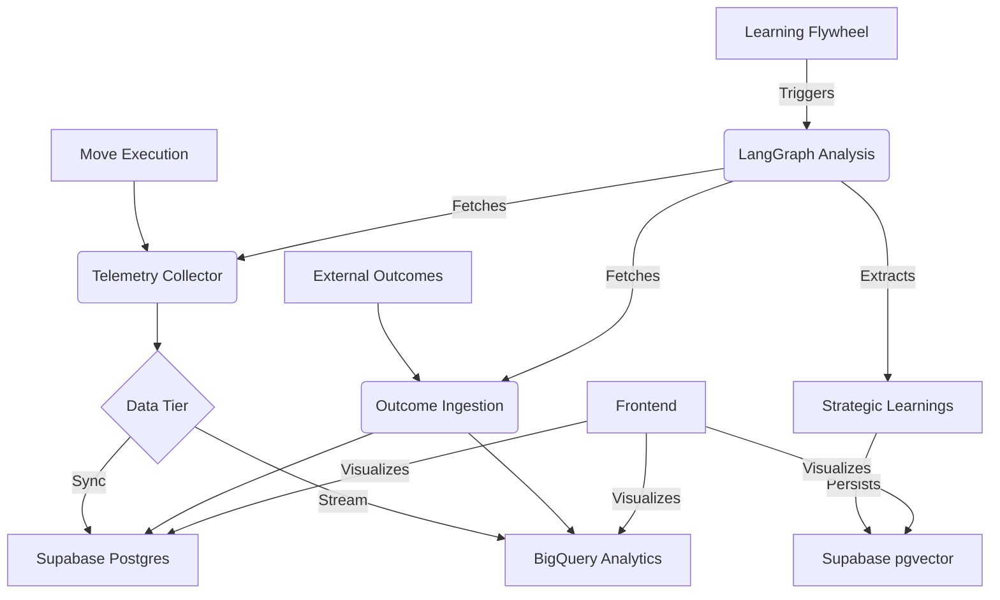

# RaptorFlow Agentic Spine

This is the Python-based creative engine for RaptorFlow, built with FastAPI and LangGraph.

## Tech Stack
- **Framework:** FastAPI
- **Orchestration:** LangGraph
- **Inference:** Vertex AI (Gemini 2.5 Flash/Flash-Lite)
- **Database:** Supabase (PostgreSQL + pgvector)

## Setup
1. Use Python 3.11-3.13 (Python 3.14 is not supported by current LangChain/Pydantic compatibility layers).
1. Install dependencies:
   ```bash
   poetry install
   ```
2. Set environment variables:
   - `DATABASE_URL`: Supabase postgres connection string.
   - `SERPER_API_KEY`: Search API key.
   - `INFERENCE_PROVIDER`: "google" (default).
   - `RF_INTERNAL_KEY`: Secret key for API auth.

### PhonePe Standard Checkout v2
Set the following environment variables for PhonePe checkout:
- `PHONEPE_CLIENT_ID`: Client ID from PhonePe dashboard.
- `PHONEPE_CLIENT_SECRET`: Client secret from PhonePe dashboard.
- `PHONEPE_CLIENT_VERSION`: Client version (e.g., `1`).
- `PHONEPE_ENV`: `SANDBOX` for UAT or `PRODUCTION` for live payments.
- `PHONEPE_WEBHOOK_USERNAME`: Webhook username configured in the PhonePe portal.
- `PHONEPE_WEBHOOK_PASSWORD`: Webhook password configured in the PhonePe portal.

**SANDBOX vs PRODUCTION**
- Use `PHONEPE_ENV=SANDBOX` for testing against the sandbox environment.
- Use `PHONEPE_ENV=PRODUCTION` when going live; ensure webhook credentials and redirect URLs are updated.

### How to test locally (PhonePe)
1. Run the backend:
   ```bash
   uvicorn backend.main:app --reload
   ```
2. Start an ngrok tunnel for the webhook endpoint:
   ```bash
   ngrok http 8000
   ```
3. Configure the PhonePe webhook URL to:
   ```
   https://<ngrok-subdomain>.ngrok.io/v1/payments/webhook
   ```
4. Initiate a payment:
   ```bash
   curl -X POST "http://localhost:8000/v1/payments/initiate?user_id=test&amount=10.5&transaction_id=order-123&redirect_url=http://localhost:3000/success"
   ```
5. Check order status after redirect (optional):
   ```bash
   curl "http://localhost:8000/v1/payments/status/order-123"
   ```

## Deployment
Deploy to Google Cloud Run:
```bash
gcloud run deploy raptorflow-spine --source .
```

## Blackbox Architecture
The Blackbox is the "Cognitive Spine" of RaptorFlow, handling industrial-scale telemetry and automated learning.



### Core Components
- **Telemetry System:** High-throughput capture of agent traces.
- **ROI Engine:** Probabilistic attribution of outcomes to moves.
- **Learning Flywheel:** Multi-agentic reflection extracting strategic pivots from raw data.
- **Memory Layer:** Dual-tier storage (Redis for session, pgvector for long-term).
