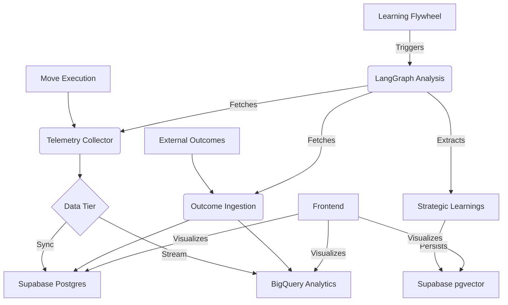

# RaptorFlow Agentic Spine

This is the Python-based creative engine for RaptorFlow, built with FastAPI and LangGraph.

## Tech Stack
- **Framework:** FastAPI
- **Orchestration:** LangGraph
- **Inference:** Vertex AI (Gemini)
- **Database:** Supabase (PostgreSQL + pgvector)

## Setup
1. Install dependencies:
   ```bash
   poetry install
   ```
2. Set environment variables:
   - `DATABASE_URL`: Supabase postgres connection string.
   - `SERPER_API_KEY`: Search API key.
   - `INFERENCE_PROVIDER`: "google" (default).
   - `RF_INTERNAL_KEY`: Secret key for API auth.

## Deployment
Deploy to Google Cloud Run:
```bash
gcloud run deploy raptorflow-spine --source .
```

## Blackbox Architecture
The Blackbox is the "Cognitive Spine" of RaptorFlow, handling industrial-scale telemetry and automated learning.



### Core Components
- **Telemetry System:** High-throughput capture of agent traces.
- **ROI Engine:** Probabilistic attribution of outcomes to moves.
- **Learning Flywheel:** Multi-agentic reflection extracting strategic pivots from raw data.
- **Memory Layer:** Dual-tier storage (Redis for session, pgvector for long-term).
