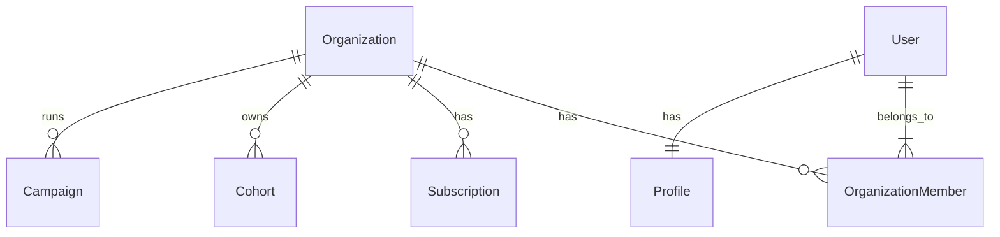

# Core Database Schema

## Overview
The core schema implements a multi-tenant architecture where `Organization` is the top-level entity.

## ER Diagram (Conceptual)

## Tables

### `public.organizations`
The central tenant entity.
- `id`: UUID (PK)
- `name`: VARCHAR(255)
- `slug`: VARCHAR(100) UNIQUE - for URLs
- `settings`: JSONB - tenant specific configurations
- `deleted_at`: TIMESTAMPTZ - for soft deletes

### `public.profiles`
Extended user information linked to `auth.users`.
- `id`: UUID (PK, FK to auth.users)
- `email`: TEXT
- `onboarding_completed`: BOOLEAN
- `current_org_id`: UUID - last accessed organization

### `public.organization_members`
Junction table for User-Organization many-to-many relationship.
- `organization_id`: UUID
- `user_id`: UUID
- `role`: `org_role` (owner, admin, member, viewer)
- `permissions`: JSONB - granular overrides

## Indexes
- `idx_organizations_slug`
- `idx_org_members_user`
- `idx_org_members_org`
