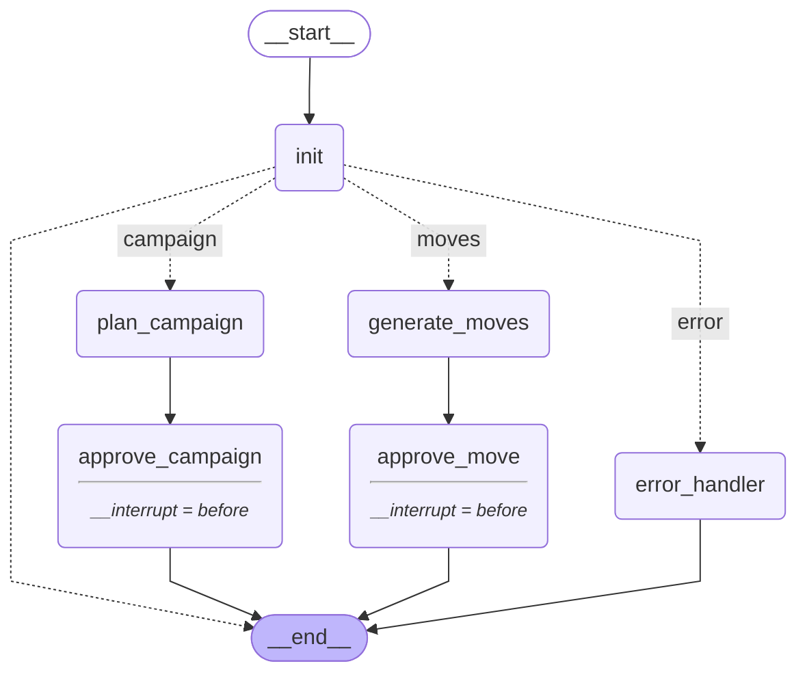

```mermaid
---
config:
  flowchart:
    curve: linear
---
graph TD;
	__start__([<p>__start__</p>]):::first
	init(init)
	plan_campaign(plan_campaign)
	approve_campaign(approve_campaign<hr/><small><em>__interrupt = before</em></small>)
	generate_moves(generate_moves)
	approve_move(approve_move<hr/><small><em>__interrupt = before</em></small>)
	error_handler(error_handler)
	__end__([<p>__end__</p>]):::last
	__start__ --> init;
	generate_moves --> approve_move;
	init -.-> __end__;
	init -. &nbsp;error&nbsp; .-> error_handler;
	init -. &nbsp;moves&nbsp; .-> generate_moves;
	init -. &nbsp;campaign&nbsp; .-> plan_campaign;
	plan_campaign --> approve_campaign;
	approve_campaign --> __end__;
	approve_move --> __end__;
	error_handler --> __end__;
	classDef default fill:#f2f0ff,line-height:1.2
	classDef first fill-opacity:0
	classDef last fill:#bfb6fc

```