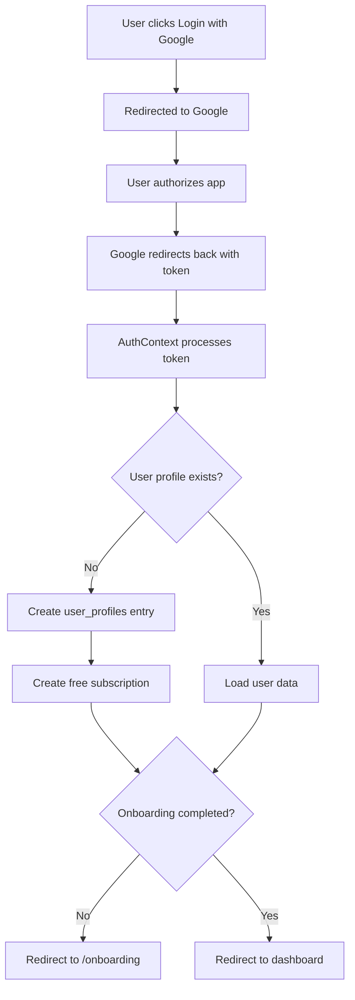

# 🚀 Google OAuth + Supabase Setup Complete!

## ✅ What Has Been Implemented

Your Raptorflow application now has a complete authentication and onboarding system:

### 1. **Database Tables Created** 
   - ✅ `subscriptions` - Track user subscription plans
   - ✅ `onboarding_responses` - Store onboarding data with AI-generated ICPs
   - ✅ `user_profiles` - Extended user information and onboarding status
   - ✅ Auto-trigger: Creates profile and free subscription on user signup

### 2. **Authentication Flow Enhanced**
   - ✅ Google OAuth login fully configured
   - ✅ Email/password login (existing)
   - ✅ Automatic profile creation on first login
   - ✅ Subscription status tracking
   - ✅ Onboarding completion tracking

### 3. **Onboarding System**
   - ✅ Automatic redirect to onboarding after first login
   - ✅ AI-powered question generation
   - ✅ Save responses to Supabase
   - ✅ Mark onboarding as complete
   - ✅ Prevent re-showing onboarding to completed users

### 4. **Protected Routes**
   - ✅ Require authentication for all protected pages
   - ✅ Redirect to onboarding if not completed
   - ✅ Skip onboarding redirect on /onboarding page itself

## 📋 Next Steps

### Step 1: Set Up Supabase (5-10 minutes)

1. **Create a Supabase project**:
   - Go to https://app.supabase.com/
   - Click "New project"
   - Choose a name, password, and region
   - Wait for setup to complete

2. **Get your credentials**:
   - Go to Settings → API
   - Copy "Project URL" and "anon public" key

3. **Run database migrations**:
   - Open Supabase Dashboard → SQL Editor
   - Run each migration file in order:
     - `database/migrations/005_subscriptions_and_onboarding.sql`
   - Click "Run" for each one

### Step 2: Configure Google OAuth (10-15 minutes)

Follow the detailed guide in **`SETUP_GUIDE.md`**

Quick summary:
1. Create Google Cloud Project
2. Configure OAuth Consent Screen
3. Create OAuth Credentials
4. Get Client ID and Client Secret
5. Enable Google+ API
6. Configure in Supabase Dashboard → Authentication → Providers → Google

### Step 3: Set Up Environment Variables (2 minutes)

Create `.env.local` file in project root:

```bash
# Required - Get from Supabase Dashboard
VITE_SUPABASE_URL=https://your-project-ref.supabase.co
VITE_SUPABASE_ANON_KEY=your-anon-key-here

# Required for AI features - Get from OpenAI
VITE_OPENAI_API_KEY=sk-your-openai-key-here

# Optional but recommended - Get from Google Cloud Console
VITE_GOOGLE_MAPS_API_KEY=your-google-maps-key
```

See **`docs/ENVIRONMENT_VARIABLES.md`** for all variables.

### Step 4: Test the Setup (5 minutes)

```bash
# Install dependencies (if not already done)
npm install

# Start the dev server
npm run dev
```

Then test:
1. ✅ Navigate to `http://localhost:3000/login`
2. ✅ Click "Continue with Google"
3. ✅ Sign in with Google
4. ✅ You should be redirected to onboarding
5. ✅ Complete the onboarding questions
6. ✅ Verify data is saved in Supabase

## 🔍 How It Works

### Login Flow



### Onboarding Flow

```
User completes onboarding
  ↓
Saves answers to onboarding_responses table
  ↓
Marks onboarding_completed = true in user_profiles
  ↓
Redirects to dashboard
  ↓
ProtectedRoute checks onboarding_completed
  ↓
Allows access to all protected pages
```

## 📁 Files Modified/Created

### Created:
- ✅ `database/migrations/005_subscriptions_and_onboarding.sql` - Database schema
- ✅ `SETUP_GUIDE.md` - Complete setup instructions
- ✅ `docs/ENVIRONMENT_VARIABLES.md` - Environment variable reference
- ✅ `docs/QUICK_START.md` - This file

### Modified:
- ✅ `src/context/AuthContext.jsx` - Added subscription & onboarding tracking
- ✅ `src/components/ProtectedRoute.jsx` - Added onboarding redirect logic
- ✅ `src/components/Onboarding.jsx` - Save to database & mark complete
- ✅ `src/App.jsx` - Onboarding route doesn't require onboarding completion

## 🎯 Testing Checklist

After setup, verify these work:

- [ ] Google OAuth login redirects correctly
- [ ] User profile is created in `user_profiles` table
- [ ] Free subscription is created in `subscriptions` table
- [ ] New users are redirected to onboarding
- [ ] Onboarding responses are saved to `onboarding_responses` table
- [ ] After onboarding, `onboarding_completed` is set to `true`
- [ ] Users who completed onboarding can access protected pages
- [ ] Completed users are NOT redirected to onboarding again
- [ ] Logout works correctly
- [ ] Email/password login still works

## 🐛 Troubleshooting

### "Google OAuth is not enabled"
- ✅ Enable Google provider in Supabase: Authentication → Providers → Google
- ✅ Add Client ID and Client Secret
- ✅ Click Save

### "Redirect URI mismatch"
- ✅ Check redirect URI in Google Cloud Console matches:
  `https://your-project-ref.supabase.co/auth/v1/callback`

### "User created but onboarding not showing"
- ✅ Check browser console for errors
- ✅ Verify `user_profiles` table exists
- ✅ Verify migration 005 ran successfully
- ✅ Check `onboarding_completed` column exists

### "Migration failed"
- ✅ Run migrations in order
- ✅ Check for previous migration dependencies
- ✅ Look at error message in SQL Editor

## 📚 Documentation

- **Complete Setup Guide**: `SETUP_GUIDE.md`
- **Environment Variables**: `docs/ENVIRONMENT_VARIABLES.md`
- **Google OAuth Setup**: `docs/GOOGLE_OAUTH_SETUP.md`
- **Database Schema**: `database/migrations/005_subscriptions_and_onboarding.sql`

## 🔐 Security Reminders

- ⚠️ Never commit `.env.local` to git (already in `.gitignore`)
- 🔑 Use different keys for dev/production
- 🔄 Rotate API keys regularly
- 🛡️ Enable 2FA on all service accounts
- 📊 Monitor API usage in dashboards

## 🎨 Customization

Want to customize the onboarding experience?

1. **Add more questions**: Edit `INITIAL_QUESTIONS` in `src/components/Onboarding.jsx`
2. **Change AI prompts**: Edit functions in `src/lib/ai.js`
3. **Add subscription plans**: Add rows to `subscriptions` table
4. **Customize redirect**: Edit `ProtectedRoute.jsx` logic

## 🚢 Deployment

When deploying to production:

1. ✅ Update Google OAuth redirect URIs with production URL
2. ✅ Update Supabase Site URL to production domain
3. ✅ Set production environment variables in hosting platform
4. ✅ Test OAuth flow on production
5. ✅ Enable RLS policies for security

## 💡 Next Features to Implement

1. **Subscription Plans**: Integrate Stripe for paid plans
2. **Email Verification**: Enable in Supabase Authentication
3. **Password Reset**: Add forgot password flow
4. **Social Providers**: Add GitHub, LinkedIn, Twitter OAuth
5. **Onboarding Analytics**: Track completion rates
6. **Skip Onboarding**: Add option to skip for some users

---

## 🎉 You're Ready!

Your authentication and onboarding system is fully set up. Follow the steps above to configure your Supabase project and Google OAuth, then you'll be ready to go!

**Need help?** Check:
- `SETUP_GUIDE.md` for detailed setup instructions
- Browser console for error messages
- Supabase logs for database errors
- Google Cloud Console for OAuth errors

**Last Updated**: 2025-11-22

