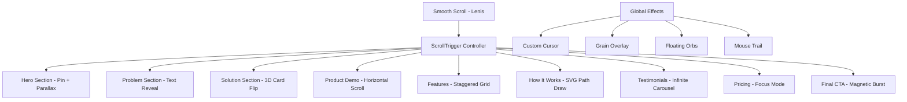
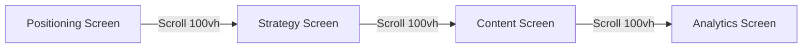
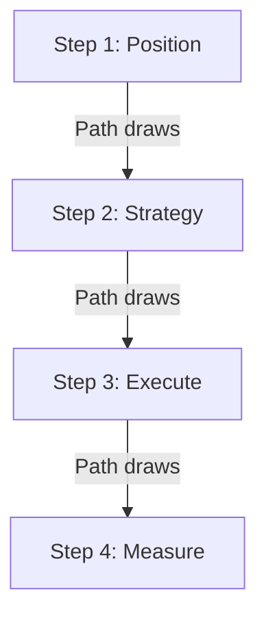

# RaptorFlow — Award-Winning GSAP Landing Page Architecture

## Executive Vision

Transform the RaptorFlow landing page into a **cinema-grade, scroll-driven narrative experience** that wins awards. This is not just a landing page—it's a product story told through motion.

**Core Philosophy**: Every scroll is a scene change. Every section is a set piece. Every interaction is a moment of delight.

---

## Visual Identity Foundation

### Color System (Preserved + Enhanced)
```
Canvas:      #F5F3EE (Warm architectural paper)
Paper:       #FFFEF9 (Pure paper white)
Ink:         #1A1A1A (Primary text)
Muted:       #7A7A7A (Secondary text)
Blueprint:   #3A5A7C (Strategic accent)
Coral:       #E08D79 (Warm energy accent)
Sage:        #9CAF98 (Growth accent)
Ocean:       #8CA9B3 (Calm accent)
Lavender:    #B3A5B8 (Creative accent)
```

### Typography Hierarchy
```
Display:     font-editorial, 72px-120px, -0.02em tracking
Headline:    font-editorial, 48px-64px, -0.01em tracking
Title:       font-sans, 24px-32px, 0 tracking
Body:        font-sans, 16px-18px, 0.01em tracking
Caption:     font-sans, 12px-14px, 0.02em tracking
```

---

## GSAP Architecture Overview



---

## Section-by-Section Animation Spec

### 1. Preloader — "The Raptor Awakens"
**Duration**: 2.5s | **Easing**: `expo.inOut`

- **Frame 1 (0-0.5s)**: Black screen, single dot appears center
- **Frame 2 (0.5-1.2s)**: Dot expands into RaptorFlow logo stroke drawing (SVG path animation)
- **Frame 3 (1.2-1.8s)**: Logo fills with ink, subtle paper texture fades in
- **Frame 4 (1.8-2.5s)**: Logo scales down 10%, screen wipes to reveal Hero

**GSAP Techniques**: `DrawSVGPlugin`, `MorphSVG`, `CustomEase`

---

### 2. Hero Section — "The Void Before Creation"
**Pin Duration**: 100vh scroll | **Z-Index**: 100

#### Layer Architecture (Parallax Depth)
```
Layer 1:  WebGL Grain Shader (z: -100, speed: 0.1x)
Layer 2:  Gradient Orbs with Mouse Reactivity (z: -50, speed: 0.3x)
Layer 3:  Grid Lines with Draw Animation (z: -20, speed: 0.5x)
Layer 4:  Main Headline — "Stop posting. Start building." (z: 0, speed: 1x)
Layer 5:  Subheadline + CTAs (z: 10, speed: 1.2x)
Layer 6:  Dashboard Preview (z: 30, speed: 1.5x, enters from bottom)
```

#### Scroll Animation Timeline
| Scroll % | Element | Animation |
|----------|---------|-----------|
| 0-20% | Headline Word 1 | `y: 100 → 0`, `opacity: 0 → 1`, `rotateX: 45° → 0°` |
| 10-30% | Headline Word 2 | `y: 100 → 0`, `opacity: 0 → 1`, `rotateX: 45° → 0°` |
| 20-40% | Subheadline | `y: 50 → 0`, `opacity: 0 → 1`, `blur: 10px → 0` |
| 30-50% | CTA Buttons | `scale: 0.8 → 1`, `opacity: 0 → 1`, stagger 0.1s |
| 40-70% | Dashboard | `y: 200 → 0`, `rotateX: 25° → 0°`, `opacity: 0 → 1` |
| 60-100% | All Content | `y: 0 → -100`, `opacity: 1 → 0` (exit) |

**Special Effects**:
- **Magnetic CTAs**: Buttons attract to cursor within 100px radius (`gsap.quickTo`)
- **Text Split**: Each word splits into characters, staggers in with random delay
- **Grain Shader**: Custom WebGL noise that responds to scroll velocity

---

### 3. Problem Section — "The Founder Trap"
**Transition**: Seamless from Hero | **Background**: Shifts to `#FDFCFA`

#### Animation Sequence
1. **Text Reveal**: The statement "You did not start a company..." types in character by character
2. **Problem Cards**: Each pain point slides in from alternating sides with `skewX` distortion
3. **Counter Scroll**: Cards move 20% slower than scroll (parallax disconnect)

| Element | Animation | Trigger |
|---------|-----------|---------|
| Section Label | `letterSpacing: 0.5em → 0.3em`, `opacity: 0 → 1` | Top 80% |
| Main Statement | SplitText chars stagger `y: 20 → 0`, `opacity: 0 → 1` | Top 70% |
| Problem Card 1 | `x: -100 → 0`, `skewX: -10° → 0°` | Top 60% |
| Problem Card 2 | `x: 100 → 0`, `skewX: 10° → 0°` | Top 55% |
| Problem Card 3 | `x: -100 → 0`, `skewX: -10° → 0°` | Top 50% |
| Problem Card 4 | `x: 100 → 0`, `skewX: 10° → 0°` | Top 45% |
| Bottom Statement | `clipPath: inset(100% 0 0 0) → inset(0)` | Top 30% |

---

### 4. Solution Section — "The Marketing OS"
**Layout**: 3-Pillar Reveal | **Background**: Paper white with subtle orb

#### 3D Card Animation
Each pillar card starts `rotateY: 90°` and flips into view as user scrolls:

```javascript
// GSAP Timeline Concept
tl.fromTo(pillarCards,
  { rotateY: 90, opacity: 0, transformOrigin: "left center" },
  {
    rotateY: 0,
    opacity: 1,
    stagger: 0.2,
    ease: "back.out(1.7)",
    scrollTrigger: { trigger: section, start: "top 60%" }
  }
);
```

**Hover State**: Card lifts (`translateZ: 30px`), shadow deepens, icon pulses once

---

### 5. Product Demo — "Horizontal Scroll Theater"
**Pin**: Section pins for 400vh | **Scroll**: Horizontal movement

#### Theater Concept
The page scroll locks, and content moves horizontally revealing 4 product screens:



#### Per-Screen Animation
| Screen | Entrance | Feature List |
|--------|----------|--------------|
| Positioning | `x: 100vw → 0`, `scale: 0.9 → 1` | Stagger fade up |
| Strategy | `clipPath: circle(0%) → circle(150%)` | Radial reveal |
| Content | `x: 100vw → 0`, `rotate: 5° → 0°` | Cards cascade |
| Analytics | `opacity: 0 → 1`, `filter: blur(20px) → blur(0)` | Data bars grow |

**Progress Indicator**: Thin line at bottom fills as user scrolls through screens

---

### 6. Features Grid — "The Constellation"
**Layout**: 8-card asymmetric grid | **Effect**: Scatter → Organize

#### Animation Behavior
1. **Initial State**: Cards scattered randomly across viewport (absolute positioning)
2. **Scroll Trigger**: Cards animate to grid positions with spring physics
3. **Final State**: Perfect 4x2 grid

```javascript
// Scatter positions (randomized)
const scatterPositions = cards.map(() => ({
  x: random(-window.innerWidth/2, window.innerWidth/2),
  y: random(-window.innerHeight/2, window.innerHeight/2),
  rotation: random(-30, 30)
}));

// Animate to grid
ScrollTrigger.create({
  trigger: section,
  start: "top 70%",
  onEnter: () => {
    gsap.to(cards, {
      x: (i) => gridPositions[i].x,
      y: (i) => gridPositions[i].y,
      rotation: 0,
      stagger: 0.05,
      ease: "elastic.out(1, 0.5)",
      duration: 1.2
    });
  }
});
```

**Hover**: Card glows (`box-shadow` with accent color), icon rotates 360°

---

### 7. How It Works — "The Journey Path"
**Layout**: SVG Path Timeline | **Animation**: Path Draw + Step Reveal

#### SVG Path Animation
- A curved path draws from top to bottom as user scrolls
- Each step node activates when path reaches it
- Active node: Scales 1.2x, pulses ring, number glows



---

### 8. Social Proof — "The Infinite River"
**Layout**: Full-width infinite scroll | **Effect**: Marquee + Hover Pause

#### Logo Cloud Animation
- Logos move continuously left-to-right
- Speed increases when user scrolls down
- Hover: Slows to 10% speed, hovered logo scales 1.1x

---

### 9. Testimonials — "The Voice Carousel"
**Layout**: 3D Coverflow | **Effect**: Depth + Reflection

#### 3D Carousel Behavior
- Active testimonial: `scale: 1`, `z: 0`, full opacity
- Adjacent: `scale: 0.85`, `z: -100`, `rotateY: ±25°`, 60% opacity
- Transition: Spring physics with overshoot

**Auto-play**: Every 5s with progress bar

---

### 10. Pricing — "The Choice Theater"
**Layout**: 3 Cards | **Effect**: Focus Mode

#### Focus Mode Behavior
- Default: All cards equal size
- Hover on card: Hovered card expands 110%, others dim to 60% opacity
- Click: Card expands full screen, details animate in

**Recommended Badge**: Glows with pulsing animation, subtle float

---

### 11. FAQ — "The Accordion Orchestra"
**Layout**: 2-column | **Effect**: Staggered Open

#### Animation
- Question hover: Arrow rotates 90° preview
- Open: Content height animates, surrounding items slide down
- Plus icon morphs to X (`MorphSVG`)

---

### 12. Final CTA — "The Magnetic Burst"
**Layout**: Centered | **Effect**: Explosion of possibility

#### Entrance Animation
1. Background gradient orb expands from center
2. Headline words burst in from all directions
3. CTA button magnetic effect intensifies
4. Particles burst outward on button hover

---

## Global Effects System

### Custom Cursor
```javascript
// Structure
const cursor = {
  dot: small inner dot,
  ring: outer ring that lags behind,
  text: label that appears on interactive elements
};

// Behavior
- Default: Ring 40px, dot 8px
- Hover link: Ring expands 60px, opacity 0.5
- Hover button: Ring morphs to button shape
- Click: Ring contracts rapidly then bounces back
```

### Mouse Trail
- 5-7 trailing dots following cursor
- Each dot: decreasing size, higher lag
- Color: Accent color at 20% opacity

### Grain Overlay
- Subtle animated noise texture
- Opacity: 3-5%
- Changes every 100ms for film-like effect

### Floating Orbs
- 3-5 gradient orbs floating in background
- Movement: Perlin noise-based drift
- React to scroll: Move faster when scrolling
- React to mouse: Slight attraction

---

## Technical Stack

### Required GSAP Plugins
```javascript
import gsap from 'gsap';
import { ScrollTrigger } from 'gsap/ScrollTrigger';
import { SplitText } from 'gsap/SplitText'; // Club GreenSock
import { DrawSVGPlugin } from 'gsap/DrawSVGPlugin'; // Club GreenSock
import { MorphSVGPlugin } from 'gsap/MorphSVGPlugin'; // Club GreenSock
import { CustomEase } from 'gsap/CustomEase';

// Free alternatives where applicable
import Lenis from '@studio-freight/lenis'; // Smooth scroll
```

### Performance Rules
1. **Will-Change Strategy**: Only apply to active animating elements
2. **GPU Layers**: Use `transform3d()` for all movements
3. **Debounce**: Resize observers debounced at 100ms
4. **Reduced Motion**: Full support via `prefers-reduced-motion`
5. **Mobile Optimization**: Disable heavy effects under 768px

### Animation Timing Constants
```javascript
const TIMING = {
  instant: 0.15,
  fast: 0.3,
  base: 0.5,
  slow: 0.8,
  cinematic: 1.2,
  stagger: 0.08
};

const EASING = {
  smooth: "power2.out",
  bounce: "back.out(1.7)",
  elastic: "elastic.out(1, 0.5)",
  expo: "expo.out",
  cinematic: "power3.inOut"
};
```

---

## Responsive Breakpoints

| Breakpoint | Behavior |
|------------|----------|
| Desktop 1440px+ | Full effects, horizontal scroll theater, 3D carousel |
| Desktop 1024px | Reduced particle count, simplified 3D |
| Tablet 768px | No horizontal scroll, stacked layout, reduced motion |
| Mobile 480px | Essential animations only, no custom cursor, optimized particles |

---

## Implementation Phases

### Phase 1: Foundation (Days 1-2)
- [ ] Install GSAP + plugins
- [ ] Set up Lenis smooth scroll
- [ ] Create global animation context
- [ ] Implement custom cursor

### Phase 2: Sections (Days 3-7)
- [ ] Hero with parallax layers
- [ ] Problem with text reveal
- [ ] Solution with 3D cards
- [ ] Product demo horizontal scroll

### Phase 3: Polish (Days 8-10)
- [ ] Features constellation
- [ ] Testimonials 3D carousel
- [ ] Pricing focus mode
- [ ] Final CTA magnetic burst

### Phase 4: Optimization (Days 11-12)
- [ ] Performance audit
- [ ] Reduced motion support
- [ ] Mobile optimization
- [ ] Cross-browser testing

---

## Success Metrics

- **Lighthouse Performance**: 85+ (despite heavy animations)
- **First Contentful Paint**: < 1.5s
- **Time to Interactive**: < 3s
- **Animation Frame Rate**: Consistent 60fps
- **User Engagement**: 40%+ scroll depth

---

## Award-Winning References

1. **Apple Vision Pro** — Seamless scroll-driven narrative
2. **Nike By You** — Horizontal scroll product showcase
3. **Stripe Press** — Editorial typography + motion
4. **Linear** — Grain texture + subtle depth
5. **Vercel Ship** — Section transitions + preloader
6. **Cuberto** — Custom cursor + magnetic effects
7. **Locomotive** — Smooth scroll + parallax mastery

---

*This plan creates a landing page experience worthy of Awwwards Site of the Day.*
